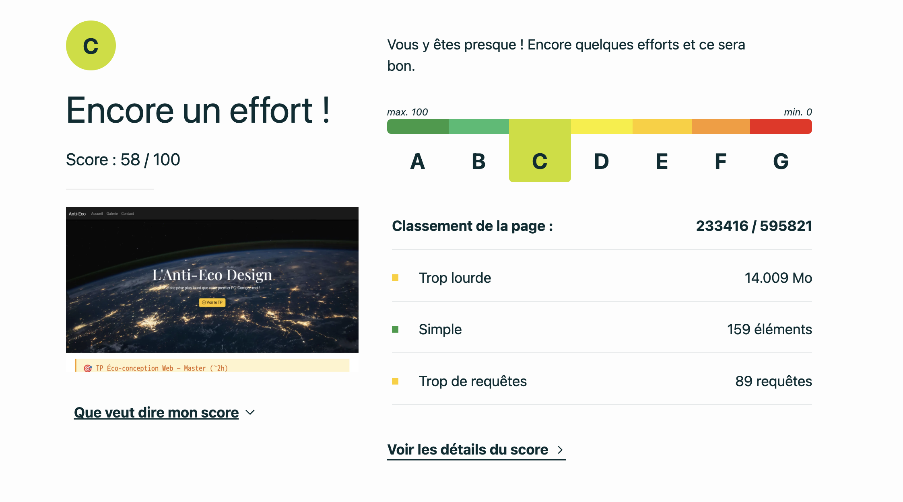
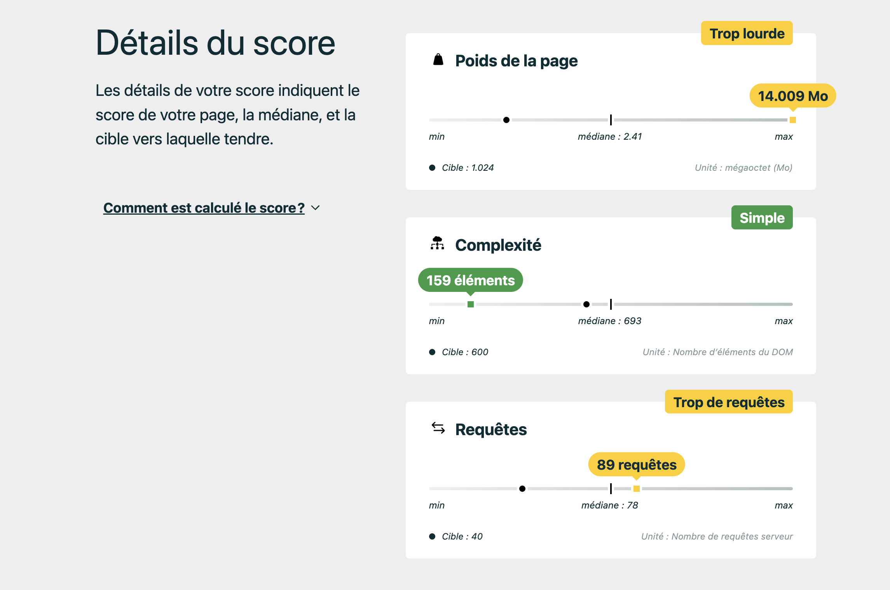

# Étape 1 — Audit (20 min)
Ouvrir DevTools → onglet Network : noter le poids total de la page au chargement.
poids: 12,90 Mo

Mesurer le score EcoIndex sur ecoindex.fr (objectif : atteindre la note A).

Lancer PageSpeed Insights et noter les métriques LCP, CLS, FID.

Mobile : 
https://pagespeed.web.dev/analysis/https-eco-conception-horror-vercel-app/8jm85h1vf3?form_factor=mobile

Desktop : 
https://pagespeed.web.dev/analysis/https-eco-conception-horror-vercel-app/7wr7n52c6b?form_factor=desktop

LCP (Largest Contentful Paint) : 6,5 s
CLS (Cumulative Layout Shift) : 0.001

Lister toutes les mauvaises pratiques visibles dans le code source (il y en a au moins 10).

- Bootstrap complet chargé avec peu de composants
- Hero trop lourde (4000px)
- Manque loading="lazy" sur images 
- GIFs lourds en boucle 
- Charge excessive de polices Google 
- Code monolithique
- css et html dans la meme page 

# Étape 2 — Correction des images (40 min)

- fix Remplacer les images Unsplash 3000–4000px par des versions adaptées au contexte d'affichage (&w=800 suffit pour la galerie en 300px).

fix Ajouter loading="lazy" sur toutes les images hors-écran.

fix Ajouter les attributs width et height pour éviter le CLS.

bonus Convertir les images en format WebP avec squoosh.app et mesurer le gain en Ko.

# Étape 3 — Polices & icônes (20 min)

fix Google Fonts : ne charger que les 2 graisses réellement utilisées (ex: wght@400;700).

fix Remplacer les 5 requêtes SVG séparées par un SVG Sprite inline (un seul bloc <svg> en début de body, référencé avec <use href="#icon-id">).

fix Bootstrap Icons : remplacer par l'icône SVG inline directement dans le HTML — supprimer la feuille de style entière.

# Étape 4 — Bootstrap (20 min)
analyse Identifier ce qui est réellement utilisé de Bootstrap sur cette page (navbar + 1 bouton).

### 1) Composant Navbar
Classes Bootstrap utilisées :
- `navbar`
- `navbar-expand-lg`
- `navbar-dark`
- `container-fluid`
- `navbar-brand`
- `navbar-toggler`
- `navbar-toggler-icon`
- `collapse`
- `navbar-collapse`
- `navbar-nav`
- `nav-item`
- `nav-link`

### 2) Composant Bouton
Classes Bootstrap sur un bouton :
- `btn`
- `btn-warning`
- `mt-3`

fix Option A : Écrire le CSS de la navbar manuellement (~20 lignes) et supprimer Bootstrap entièrement.
fix Option B : Utiliser PurgeCSS ou le système de build Bootstrap pour n'exporter que les composants utilisés.
réflexion Comparer le poids avant/après. Combien de Ko Bootstrap coûtait pour 2 composants ? https://cdn.jsdelivr.net/npm/bootstrap@5.3.3/dist/css/bootstrap.min.css : 233 ko et https://cdn.jsdelivr.net/npm/bootstrap@5.3.3/dist/js/bootstrap.bundle.min.js : 80,7 ko

